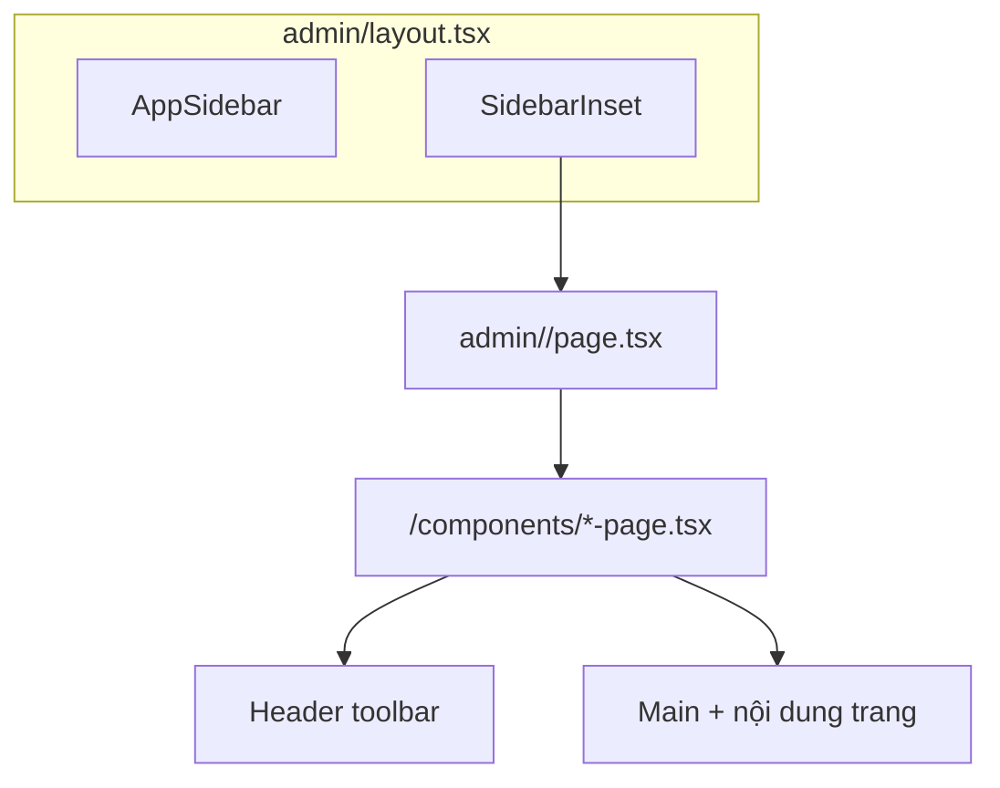

# Dashboard UI Template Playbook (Next.js)

| Meta | Value |
|------|--------|
| **Version** | 2.2.0 |
| **Last updated** | 2026-05-25 |
| **Primary stack** | Next.js App Router + React + TypeScript + shadcn/ui |
| **UI reference** | [shadcn-admin](https://github.com/satnaing/shadcn-admin) v2.2.x |
| **Architecture** | `(admin)/admin/<route>/components/` + `page.tsx` (theo convention của bạn) |

---

## Mục đích

Playbook **portable** — copy file này sang project Next.js khác. Mục tiêu: dựng **UI/UX dashboard admin** (sidebar, header toolbar, table, form, …) giống shadcn-admin **không** cần clone repo.

- **Reference code:** repo shadcn-admin (đường dẫn trong cột Reference).
- **Kiến trúc thư mục:** theo convention `(admin)/admin/...` như bạn đang dùng.

---

## Table of Contents

1. [Kiến trúc thư mục `(admin)/admin`](#1-kiến-trúc-thư-mục-adminadmin)
2. [Phân tầng component: Global vs Page-local](#2-phân-tầng-component-global-vs-page-local)
3. [Catalog UI/UX — danh sách đầy đủ](#3-catalog-uiux--danh-sách-đầy-đủ)
4. [Admin shell — `admin/layout.tsx`](#4-admin-shell--adminlayouttsx)
5. [Sidebar — chi tiết setup UI](#5-sidebar--chi-tiết-setup-ui)
6. [Header toolbar — chi tiết setup UI](#6-header-toolbar--chi-tiết-setup-ui)
7. [Main content area](#7-main-content-area)
8. [Page setup recipes](#8-page-setup-recipes)
9. [Data Table — stack UI đầy đủ](#9-data-table--stack-ui-đầy-đủ)
10. [Dialogs, Drawer, Form UI](#10-dialogs-drawer-form-ui)
11. [Bootstrap & dependencies](#11-bootstrap--dependencies)
12. [Theme, fonts, RTL](#12-theme-fonts-rtl)
13. [Handoff checklist](#13-handoff-checklist)
14. [Charts & data visualization](#14-charts--data-visualization)
15. [Coverage — đã đủ chưa?](#15-coverage--đã-đủ-chưa)

---

## 1. Kiến trúc thư mục `(admin)/admin`

### 1.1 Cây thư mục chuẩn (theo convention của bạn)

```text
app/
├── layout.tsx                          # Root: fonts, Providers, Toaster
├── globals.css
├── (auth)/
│   └── sign-in/page.tsx
└── (admin)/
    └── admin/                          # URL prefix: /admin/*
        ├── layout.tsx                  # ★ Shell chung: Sidebar + SidebarInset (KHÔNG Header/Main ở đây)
        ├── dashboard/
        │   ├── page.tsx                # Mỏng — ghép UI từ ./components
        │   └── components/
        │       ├── dashboard-page.tsx  # (tùy tên) composition Header+Main
        │       ├── overview-cards.tsx
        │       └── ...
        ├── users/
        │   ├── page.tsx
        │   └── components/
        │       ├── users-page.tsx
        │       ├── users-table.tsx
        │       ├── users-columns.tsx
        │       ├── users-toolbar-actions.tsx
        │       └── users-mutate-drawer.tsx
        ├── items/
        ├── decors/
        ├── flower-templates/
        └── synergies/
```

### 1.2 Quy tắc bắt buộc

| Quy tắc | Giải thích |
|---------|------------|
| **Một `layout.tsx` tại `admin/`** | Chỉ chứa **shell cố định**: sidebar + vùng `{children}`. Mọi trang con dùng chung. |
| **Mỗi route = một folder** | `admin/users/` → URL `/admin/users`. |
| **`page.tsx` mỏng** | Chỉ import 1 component chính từ `./components/*-page.tsx` (hoặc server fetch rồi pass props). |
| **`components/` theo route** | UI **chỉ dùng cho trang đó** đặt trong folder route; không để trong `features/` tách xa trừ khi bạn chủ đích. |
| **Shared UI** | Sidebar, Header, Table kit → `src/components/` (dùng lại nhiều trang). |

### 1.3 Sơ đồ render



### 1.4 Mapping URL ↔ sidebar

Ví dụ `sidebar-data` dùng path **đầy đủ**:

| Menu label | `url` trong config |
|------------|-------------------|
| Dashboard | `/admin/dashboard` |
| Users | `/admin/users` |
| Items | `/admin/items` |

`middleware.ts` matcher: `/admin/:path*`

---

## 2. Phân tầng component: Global vs Page-local

### 2.1 Global (`src/components/`) — copy một lần, dùng mọi trang admin

| Folder / file | Vai trò |
|---------------|---------|
| `components/ui/*` | shadcn primitives |
| `components/layout/app-sidebar.tsx` | Sidebar assembly |
| `components/layout/header.tsx` | Top bar + SidebarTrigger |
| `components/layout/main.tsx` | Vùng content padding / fixed |
| `components/layout/nav-group.tsx` | Render từng nhóm menu |
| `components/layout/data/sidebar-data.ts` | **Config menu** |
| `components/data-table/*` | Toolbar, pagination, filters, bulk bar |
| `components/search.tsx` | Nút mở Command palette |
| `components/command-menu.tsx` | ⌘K dialog |
| `components/theme-switch.tsx` | Light/dark toggle |
| `components/profile-dropdown.tsx` | Avatar menu user |
| `components/config-drawer.tsx` | Layout/theme config drawer |
| `components/skip-to-main.tsx` | Accessibility |
| `components/navigation-progress.tsx` | Top loading bar khi chuyển trang |
| `components/confirm-dialog.tsx` | Xác nhận xóa |
| `components/date-picker.tsx` | Chọn ngày trong form/table filter |
| `components/password-input.tsx` | Input mật khẩu + toggle hiện/ẩn |
| `components/select-dropdown.tsx` | Select tái sử dụng (label + options) |
| `components/long-text.tsx` | Text dài trong table — tooltip khi overflow |
| `components/sign-out-dialog.tsx` | Confirm đăng xuất từ profile menu |
| `components/coming-soon.tsx` | Placeholder trang chưa làm |

### 2.2 Page-local (`admin/<route>/components/`) — mỗi trang tự quản

| File pattern | Dùng cho |
|--------------|----------|
| `<route>-page.tsx` | **Composition root** — Header + Main + ghép block con |
| `<entity>-table.tsx` | Bảng + TanStack Table instance |
| `<entity>-columns.tsx` | Column definitions |
| `<entity>-primary-buttons.tsx` | Nút Create / Import bên phải page heading |
| `<entity>-mutate-drawer.tsx` | Sheet tạo/sửa |
| `<entity>-dialogs.tsx` | Gom Dialog/Alert delete |
| `<entity>-provider.tsx` | Context mở dialog (`create` \| `update` \| `delete`) |
| `*-bulk-actions.tsx` | Nút bulk gắn vào `DataTableBulkActions` |
| `overview-*.tsx`, `*-chart.tsx` | Chỉ trang dashboard |

### 2.3 `page.tsx` mẫu

```tsx
// app/(admin)/admin/users/page.tsx
import { UsersPage } from './components/users-page'

export default function Page() {
  return <UsersPage />
}
```

```tsx
// app/(admin)/admin/users/components/users-page.tsx
'use client' // nếu có table/dialog tương tác

import { Header } from '@/components/layout/header'
import { Main } from '@/components/layout/main'
import { Search } from '@/components/search'
import { ThemeSwitch } from '@/components/theme-switch'
import { ProfileDropdown } from '@/components/profile-dropdown'
import { UsersTable } from './users-table'
import { UsersPrimaryButtons } from './users-primary-buttons'
import { UsersProvider } from './users-provider'
import { UsersDialogs } from './users-dialogs'

export function UsersPage() {
  return (
    <UsersProvider>
      <Header fixed>
        <Search className='me-auto' />
        <ThemeSwitch />
        <ProfileDropdown />
      </Header>
      <Main className='flex flex-1 flex-col gap-4 sm:gap-6'>
        {/* Page heading block — xem §8 */}
        <div className='flex flex-wrap items-end justify-between gap-2'>
          <div>
            <h2 className='text-2xl font-bold tracking-tight'>Users</h2>
            <p className='text-muted-foreground'>Manage users.</p>
          </div>
          <UsersPrimaryButtons />
        </div>
        <UsersTable />
      </Main>
      <UsersDialogs />
    </UsersProvider>
  )
}
```

---

## 3. Catalog UI/UX — danh sách đầy đủ

Bảng master: **mọi khối UI** trong template dashboard. Dùng như checklist khi setup trang mới.

### 3.1 Shell & layout (luôn có trong admin)

| # | UI block | Mô tả UX | Component / file | Reference |
|---|----------|----------|------------------|-----------|
| S1 | **SidebarProvider** | State mở/đóng, mobile sheet | `ui/sidebar` | `authenticated-layout.tsx` |
| S2 | **AppSidebar** | Cột nav trái | `layout/app-sidebar.tsx` | ✓ |
| S3 | **SidebarHeader** | Logo / Team switcher | `TeamSwitcher` hoặc `AppTitle` | `app-sidebar.tsx` |
| S4 | **TeamSwitcher** | Dropdown đổi team/workspace | `layout/team-switcher.tsx` | ✓ |
| S5 | **AppTitle** | Tên app + subtitle (thay team) | `layout/app-title.tsx` | ✓ |
| S6 | **SidebarContent** | Danh sách nav groups | `NavGroup` × N | ✓ |
| S7 | **SidebarGroupLabel** | Tiêu đề nhóm ("General") | `ui/sidebar` | `nav-group.tsx` |
| S8 | **SidebarMenuLink** | Item link đơn + icon + badge | `nav-group.tsx` | ✓ |
| S9 | **SidebarMenuCollapsible** | Item có submenu | `Collapsible` + sub items | ✓ |
| S10 | **SidebarMenuCollapsedDropdown** | Submenu khi sidebar thu gọn | `DropdownMenu` | ✓ |
| S11 | **NavBadge** | Số thông báo trên menu | `ui/badge` | ✓ |
| S12 | **SidebarFooter** | User profile footer | `NavUser` | `nav-user.tsx` |
| S13 | **SidebarRail** | Vùng kéo resize/collapse | `ui/sidebar` | ✓ |
| S14 | **SidebarInset** | Vùng phải chứa pages | `ui/sidebar` | ✓ |
| S15 | **SkipToMain** | Skip link a11y | `skip-to-main.tsx` | ✓ |
| S16 | **LayoutProvider** | Variant sidebar / collapsible mode | `context/layout-provider.tsx` | ✓ |
| S17 | **SearchProvider** | State ⌘K | `context/search-provider.tsx` | ✓ |

### 3.2 Header toolbar (mỗi trang admin — trong `*-page.tsx`)

| # | UI block | Vị trí | Hành vi | Reference |
|---|----------|--------|---------|-----------|
| H1 | **Header** | Top, `fixed` optional | Sticky, shadow khi scroll | `layout/header.tsx` |
| H2 | **SidebarTrigger** | Trái header | Mở/đóng sidebar mobile/desktop | trong `Header` |
| H3 | **Separator** | Sau trigger | Vertical divider | ✓ |
| H4 | **Search** | Trái/giữa (`me-auto`) | Click → Command dialog; hiện ⌘K | `search.tsx` |
| H5 | **TopNav** | Thay Search (dashboard) | Tabs ngang shortcut | `layout/top-nav.tsx` |
| H6 | **ThemeSwitch** | Phải | Toggle light/dark/system | `theme-switch.tsx` |
| H7 | **ConfigDrawer** | Phải | Drawer: layout density, theme | `config-drawer.tsx` |
| H8 | **ProfileDropdown** | Phải | Avatar → Settings / Logout | `profile-dropdown.tsx` |
| H9 | **NavigationProgress** | Root layout | Bar loading trên cùng | `navigation-progress.tsx` |

**Thứ tự khuyến nghị trong Header (trái → phải):**

`SidebarTrigger` | `Separator` | `Search` hoặc `TopNav` | (spacer `me-auto`) | `ThemeSwitch` | `ConfigDrawer` | `ProfileDropdown`

### 3.3 Command palette (global)

| # | UI block | Mô tả | Reference |
|---|----------|-------|-----------|
| C1 | **CommandMenu** | Dialog `cmdk` — search routes/actions | `command-menu.tsx` |
| C2 | **CommandInput** | Ô tìm | `ui/command` |
| C3 | **CommandGroup** | Nhóm kết quả | ✓ |
| C4 | **CommandItem** | Từng action / link | ✓ |

Shortcut: **Ctrl+K / ⌘K** (đăng ký trong `SearchProvider`).

### 3.4 Main & page heading

| # | UI block | Mô tả | Class / pattern |
|---|----------|-------|-----------------|
| M1 | **Main** | Wrapper nội dung | `px-4 py-6`, `fixed` → flex column overflow |
| M2 | **Page title (`h1`/`h2`)** | Tên trang | `text-2xl font-bold tracking-tight` |
| M3 | **Page description** | Subtitle | `text-muted-foreground` |
| M4 | **Page actions** | Nút primary bên phải | `flex justify-between` — Import, Create |
| M5 | **Tabs (dashboard)** | Overview / Analytics | `ui/tabs` vertical/horizontal |

### 3.5 Dashboard widgets & charts (tóm tắt)

| # | UI block | Mô tả | Reference |
|---|----------|-------|-----------|
| D1 | **Stat Card (KPI)** | Số + % delta + icon | `dashboard/index.tsx` |
| D2 | **Bar chart (Overview)** | Doanh thu theo tháng — Recharts `BarChart` | `overview.tsx` |
| D3 | **Area chart (Analytics)** | 2 series clicks/uniques — `AreaChart` | `analytics-chart.tsx` |
| D4 | **Simple bar list** | Progress bar CSS (Referrers, Devices) | `analytics.tsx` → `SimpleBarList` |
| D5 | **Recent sales list** | Avatar + name + amount (không phải chart) | `recent-sales.tsx` |
| D6 | **KPI grid** | 4 cột | `sm:grid-cols-2 lg:grid-cols-4` |
| D7 | **Chart + side panel grid** | 4/7 + 3/7 | `lg:grid-cols-7` |
| D8 | **Tabs Overview / Analytics** | Đổi tab đổi bộ chart | `ui/tabs` |

> Chi tiết setup chart, code mẫu, theme tokens: **[§14 Charts](#14-charts--data-visualization)**.

### 3.6 Data Table — toàn bộ khối UI

| # | UI block | Vị trí trong trang | Chức năng | File shared |
|---|----------|-------------------|-----------|-------------|
| T1 | **DataTableToolbar** | Trên table | Search + filters + reset + view options | `data-table/toolbar.tsx` |
| T2 | **Toolbar search Input** | Trái toolbar | `globalFilter` hoặc `column filter` | ✓ |
| T3 | **DataTableFacetedFilter** | Cạnh search | Multi-select theo status/role | `faceted-filter.tsx` |
| T4 | **Reset filters Button** | Khi có filter | Ghost + icon X | ✓ |
| T5 | **DataTableViewOptions** | Phải toolbar | Ẩn/hiện cột | `view-options.tsx` |
| T6 | **Table container** | Giữa | `rounded-md border` | `ui/table` |
| T7 | **Select column** | Cột 1 | Checkbox chọn row | `tasks-columns.tsx` |
| T8 | **DataTableColumnHeader** | Header cell | Sort asc/desc/hide | `column-header.tsx` |
| T9 | **TableRow** | Body | Hover, selected state | ✓ |
| T10 | **Row actions** | Cột cuối | `DropdownMenu` Edit/Delete | trong `*-columns.tsx` |
| T11 | **DataTablePagination** | Dưới table | Page size, số trang, first/prev/next/last | `pagination.tsx` |
| T12 | **DataTableBulkActions** | Fixed bottom center | Bar nổi khi chọn ≥1 row | `bulk-actions.tsx` |
| T13 | **Empty state** | Không data | 1 row "No results" | trong `*-table.tsx` |
| T14 | **Loading skeleton** | Đang fetch | `Skeleton` rows | tự thêm |

**Page-local table files:**

| File | Nhiệm vụ |
|------|----------|
| `<entity>-table.tsx` | `useReactTable`, ghép T1–T13 |
| `<entity>-columns.tsx` | `ColumnDef[]` — accessor, cell render (Badge, Avatar) |
| `<entity>-bulk-actions.tsx` | Children của `DataTableBulkActions` |
| `data/schema.ts` | Zod type cho row (đặt `admin/<route>/` hoặc `lib/`) |

### 3.7 Form & mutate UI

| # | UI block | Dùng khi | Reference |
|---|----------|----------|-----------|
| F1 | **Mutate Drawer (Sheet)** | Create/Edit record | `tasks-mutate-drawer.tsx` |
| F2 | **Form + FormField** | Mọi input có label/error | `ui/form` |
| F3 | **Input / Textarea** | Text | `ui/input` |
| F4 | **Select** | Enum | `ui/select` |
| F5 | **Checkbox / Switch** | Boolean | `ui/checkbox`, `switch` |
| F6 | **DatePicker** | Ngày | `date-picker.tsx` |
| F7 | **Delete AlertDialog** | Xác nhận xóa | `confirm-dialog.tsx` |
| F8 | **Primary Buttons** | Create, Import | `tasks-primary-buttons.tsx` |
| F9 | **Provider context** | `open` state dialog | `tasks-provider.tsx` |
| F10 | **Dialogs aggregator** | Gom mọi dialog trang | `tasks-dialogs.tsx` |
| F11 | **Import Dialog** | Upload CSV / import data | `tasks-import-dialog.tsx` |
| F12 | **Invite Dialog** | Mời user (email role) | `users-invite-dialog.tsx` |
| F13 | **Multi-delete Dialog** | Xóa nhiều row đã chọn | `users-multi-delete-dialog.tsx` |
| F14 | **Action Dialog** | Form phức tạp trong Dialog (không Sheet) | `users-action-dialog.tsx` |
| F15 | **PasswordInput** | Auth / account forms | `password-input.tsx` |
| F16 | **SelectDropdown** | Dropdown chọn nhanh trong form | `select-dropdown.tsx` |
| F17 | **Row actions menu** | File riêng `data-table-row-actions.tsx` | `users/`, `tasks/` |

### 3.8 Settings UI (trang đặc biệt)

| # | UI block | Mô tả | Reference |
|---|----------|-------|-----------|
| ST1 | **Settings layout** | Header + sidebar trái settings | `features/settings/index.tsx` |
| ST2 | **SidebarNav** | List link dọc | `settings/components/sidebar-nav.tsx` |
| ST3 | **Profile form** | Avatar, username, email | `profile-form.tsx` |
| ST4 | **Appearance form** | Theme, font, direction | `appearance-form.tsx` |
| ST5 | **Notifications form** | Toggles | `notifications-form.tsx` |
| ST6 | **Display form** | Mật độ hiển thị / sidebar items | `display-form.tsx` |
| ST7 | **Account form** | Đổi password, v.v. | `account-form.tsx` |
| ST8 | **ContentSection** | Wrapper title + desc cho mỗi form | `content-section.tsx` |

Next.js: `admin/settings/layout.tsx` + `admin/settings/page.tsx` + `admin/settings/appearance/page.tsx`.

### 3.9 Auth & error UI (ngoài admin shell)

| # | UI block | Route / file |
|---|----------|----------------|
| A1 | **AuthLayout** | `(auth)/layout.tsx` — 1 cột card hoặc 2 cột |
| A2 | **SignInForm** | `user-auth-form.tsx` |
| A3 | **SignUpForm** | `sign-up-form.tsx` |
| A4 | **Sign-in 2-col** | Layout marketing + form (`sign-in-2.tsx`) |
| A5 | **ForgotPasswordForm** | `/forgot-password` |
| A6 | **OtpForm** | `input-otp` 6 ô | `otp-form.tsx` |
| A7 | **SignOutDialog** | Từ ProfileDropdown | `sign-out-dialog.tsx` |
| E1 | **NotFound** | `not-found.tsx` |
| E2 | **GeneralError** | `error.tsx` |
| E3 | **Unauthorized** | `401` page |
| E4 | **Forbidden** | `403` page |
| E5 | **Maintenance** | `503` page |
| E6 | **ComingSoon** | Placeholder tính năng | `coming-soon.tsx` |

### 3.10 Feedback & misc

| # | UI block | Mô tả |
|---|----------|-------|
| X1 | **Sonner Toaster** | Toast success/error |
| X2 | **Badge** | Status trong table |
| X3 | **Avatar** | User column / profile |
| X4 | **Tooltip** | Icon buttons |
| X5 | **ScrollArea** | Sidebar dài, chat list |
| X6 | **LearnMore** | Popover “learn more” | `learn-more.tsx` |
| X7 | **LongText** | Ô table text truncate + popover | `long-text.tsx` |
| X8 | **Alert** | Inline warning (form/page) | `ui/alert` |
| X9 | **Skeleton** | Loading table/cards | `ui/skeleton` |
| X10 | **Separator** | Divider header / settings | `ui/separator` |

### 3.11 ConfigDrawer — chi tiết bên trong (Theme Settings sheet)

`ConfigDrawer` không chỉ là nút Settings — bên trong có **4 section** (reference):

| # | Section | UI controls |
|---|---------|-------------|
| CF1 | **ThemeConfig** | Radio: Light / Dark / System (icon preview) |
| CF2 | **SidebarConfig** | Sidebar variant: sidebar / floating / inset |
| CF3 | **LayoutConfig** | Collapsible: offcanvas / icon / none; layout default/compact/full |
| CF4 | **DirConfig** | LTR / RTL |
| CF5 | **Reset button** | Footer — reset theme + layout + direction |

Dùng `Sheet` + `SheetTrigger` (icon Settings trên Header).

### 3.12 Page layouts đặc biệt (không phải table) — optional

Các trang demo reference — **không bắt buộc** cho template tối thiểu, nhưng nếu app cần thì copy pattern:

| # | Layout type | UI chính | Reference |
|---|-------------|----------|-----------|
| P1 | **Card grid + filter bar** | Input search + Select filter + Sort + grid Card connect/disconnect | `features/apps/index.tsx` |
| P2 | **Master–detail chat** | List conversation trái + thread phải + compose (Input, Send, attach) | `features/chats/index.tsx` |
| P3 | **NewChat dialog** | Chọn user bắt đầu chat | `chats/components/new-chat.tsx` |
| P4 | **Help center** | FAQ / support static | `help-center` route |
| P5 | **Brand icon grid** | Logo SVG trong card | `assets/brand-icons/*` |

### 3.13 shadcn/ui primitives — inventory cài qua CLI

Các primitive cần có để đủ catalog trên (check khi `shadcn add`):

`button` `input` `textarea` `label` `form` `card` `badge` `avatar` `separator` `tabs` `table` `checkbox` `select` `switch` `dialog` `alert-dialog` `sheet` `dropdown-menu` `popover` `tooltip` `scroll-area` `collapsible` `command` `calendar` `sonner` `skeleton` `alert` `radio-group` `input-otp` `sidebar`

---

## 4. Admin shell — `admin/layout.tsx`

**Chỉ** đặt shell — **không** Header/Main ở đây (mỗi page tự lắp để linh hoạt toolbar).

```tsx
// app/(admin)/admin/layout.tsx
import { SidebarProvider, SidebarInset } from '@/components/ui/sidebar'
import { AppSidebar } from '@/components/layout/app-sidebar'
import { LayoutProvider } from '@/context/layout-provider'
import { SearchProvider } from '@/context/search-provider'
import { SkipToMain } from '@/components/skip-to-main'

export default function AdminLayout({ children }: { children: React.ReactNode }) {
  return (
    <SearchProvider>
      <LayoutProvider>
        <SidebarProvider defaultOpen>
          <SkipToMain />
          <AppSidebar />
          <SidebarInset className='@container/content'>{children}</SidebarInset>
        </SidebarProvider>
      </LayoutProvider>
    </SearchProvider>
  )
}
```

| Thuộc tính UX | Chi tiết |
|---------------|----------|
| Sidebar mặc định | Mở desktop; cookie `sidebar_state` |
| Mobile | Sidebar → `Sheet` |
| Collapsed | Icon-only + dropdown submenu (S10) |
| Inset variant | `LayoutProvider` đổi `variant` / `collapsible` |

---

## 5. Sidebar — chi tiết setup UI

### 5.1 Config — `components/layout/data/sidebar-data.ts`

```ts
// Ví dụ khớp folder admin/*
navGroups: [
  {
    title: 'General',
    items: [
      { title: 'Dashboard', url: '/admin/dashboard', icon: LayoutDashboard },
      { title: 'Users', url: '/admin/users', icon: Users },
      { title: 'Items', url: '/admin/items', icon: Package },
      { title: 'Decors', url: '/admin/decors', icon: Palette },
      { title: 'Flower templates', url: '/admin/flower-templates', icon: Flower },
      { title: 'Synergies', url: '/admin/synergies', icon: Sparkles },
    ],
  },
]
```

### 5.2 Active state

- Dùng `usePathname()` (Next.js).
- `isActive` khi `pathname === url` hoặc `pathname.startsWith(url)` (nested).

### 5.3 NavUser footer

- Avatar + tên + email.
- Dropdown: Account, Billing, Log out (tùy app).

Reference: `components/layout/nav-user.tsx`, `team-switcher.tsx`.

---

## 6. Header toolbar — chi tiết setup UI

### 6.1 Props `Header`

| Prop | UX |
|------|-----|
| `fixed` | Sticky top; shadow sau scroll 10px; backdrop blur |
| children | Các block H4–H8 |

### 6.2 Khi nào dùng item nào

| Trang | Search | TopNav | ConfigDrawer |
|-------|--------|--------|--------------|
| Dashboard | ✓ hoặc TopNav | ✓ thay Search | ✓ |
| List CRUD | ✓ | — | tùy |
| Settings | ✓ | — | ✓ |

---

## 7. Main content area

```tsx
<Main className='flex flex-1 flex-col gap-4 sm:gap-6'>
  {/* Page heading */}
  {/* Page body */}
</Main>
```

| Prop `Main` | Hiệu ứng |
|-------------|----------|
| `fixed` | `flex grow flex-col overflow-hidden` — table scroll bên trong |
| `fluid` | Bỏ max-width 7xl |
| mặc định | `max-w-7xl` centered @ breakpoint lớn |

---

## 8. Page setup recipes

### 8.1 Recipe A — Dashboard (`admin/dashboard/`)

**Folder:**

```text
admin/dashboard/
├── page.tsx
└── components/
    ├── dashboard-page.tsx       # Tabs + composition
    ├── stat-cards.tsx           # 4× KPI (D1)
    ├── overview-chart.tsx       # BarChart — port từ overview.tsx
    ├── analytics-chart.tsx      # AreaChart 2 series
    ├── analytics-panel.tsx      # Card chart + SimpleBarList referrers/devices
    ├── recent-sales-list.tsx    # Avatar list (D5)
    └── simple-bar-list.tsx      # Shared CSS bar — optional tách file
```

**Cây UI (trên → dưới):**

```text
Header [ TopNav | Search | ThemeSwitch | ConfigDrawer | ProfileDropdown ]
Main
  ├─ h1 + optional actions
  └─ Tabs
       ├─ Tab "Overview"
       │    ├─ Grid 4× Stat Card (KPI)
       │    └─ Grid lg:grid-cols-7
       │         ├─ col-span-4: Card "Overview" → BarChart
       │         └─ col-span-3: Card "Recent Sales" → list
       └─ Tab "Analytics"
            └─ Analytics panel
                 ├─ Card full width → AreaChart
                 ├─ Grid 4× mini KPI cards
                 └─ Grid 7 cols: Referrers | Devices (SimpleBarList)
```

Xem **[§14](#14-charts--data-visualization)** để implement từng chart.

**`page.tsx`:**

```tsx
import { DashboardPage } from './components/dashboard-page'
export default function Page() {
  return <DashboardPage />
}
```

---

### 8.2 Recipe B — List / CRUD (`admin/users/`, `items/`, …)

**Folder chuẩn (copy cho mỗi entity):**

```text
admin/users/
├── page.tsx
└── components/
    ├── users-page.tsx           # Composition
    ├── users-primary-buttons.tsx # Create, Import (F8)
    ├── users-table.tsx          # T1–T13
    ├── users-columns.tsx
    ├── users-bulk-actions.tsx
    ├── users-mutate-drawer.tsx  # F1
    ├── users-provider.tsx       # F9
    └── users-dialogs.tsx        # F7, F10
```

**Cây UI:**

```text
UsersProvider
  Header [ Search | ThemeSwitch | ProfileDropdown ]
  Main
    ├─ Page heading: h2 + description + UsersPrimaryButtons
    └─ UsersTable
         ├─ DataTableToolbar (T1–T5)
         ├─ Table (T6–T10)
         ├─ DataTablePagination (T11)
         └─ DataTableBulkActions (T12) — fixed bottom
  UsersDialogs (drawer + delete alert)
```

**Checklist setup UI cho trang list mới:**

- [ ] Tạo folder `admin/<entity>/` + `components/`
- [ ] Copy recipe files, đổi prefix `users` → `<entity>`
- [ ] Thêm menu vào `sidebar-data.ts`
- [ ] Define columns: select, data columns, actions
- [ ] Toolbar: `searchKey` hoặc global filter + faceted filters
- [ ] Primary buttons: ít nhất **Create**
- [ ] Drawer form: fields khớp Zod schema
- [ ] Bulk: Delete (optional)
- [ ] Test mobile: toolbar wrap, pagination compact

---

### 8.3 Recipe C — Settings (`admin/settings/`)

```text
admin/settings/
├── layout.tsx              # Settings shell ST1
├── page.tsx                # Profile
├── appearance/page.tsx
├── notifications/page.tsx
└── components/
    ├── settings-sidebar-nav.tsx
    ├── profile-form.tsx
    └── appearance-form.tsx
```

**UI:** Giống trang list nhưng Main có **sidebar trái** (ST2) + form bên phải, không có DataTable.

---

### 8.4 Recipe D — Trang đơn giản (static / form-only)

Ví dụ `synergies` chỉ form hoặc read-only:

```text
admin/synergies/
├── page.tsx
└── components/
    └── synergies-page.tsx   # Header + Main + Card content
```

Không bắt buộc table nếu không có danh sách.

---

## 9. Data Table — stack UI đầy đủ

### 9.1 Thứ tự render trong `<entity>-table.tsx`

```tsx
<div className='space-y-4'>
  <DataTableToolbar table={table} searchKey='title' filters={[...]} />
  <div className='overflow-hidden rounded-md border'>
    <Table>...</Table>
  </div>
  <DataTablePagination table={table} />
  <DataTableBulkActions table={table} entityName='user'>
    <UsersBulkActions />
  </DataTableBulkActions>
</div>
```

### 9.2 Column types thường dùng

| Column | Cell UI |
|--------|---------|
| Select | `Checkbox` header + row |
| Text | `truncate` + font medium |
| Status | `Badge` variant theo enum |
| Priority | `Badge` + icon |
| Date | `date-fns` format |
| User | `Avatar` + name |
| Actions | `DropdownMenu` ⋯ |

### 9.3 Toolbar config mẫu

```tsx
<DataTableToolbar
  table={table}
  searchPlaceholder='Filter users...'
  searchKey='email'
  filters={[
    {
      columnId: 'status',
      title: 'Status',
      options: [
        { label: 'Active', value: 'active' },
        { label: 'Inactive', value: 'inactive' },
      ],
    },
  ]}
/>
```

### 9.4 `useReactTable` options khuyến nghị

| Option | Mục đích |
|--------|----------|
| `getCoreRowModel` | Bắt buộc |
| `getPaginationRowModel` | Phân trang client |
| `getSortedRowModel` | Sort cột |
| `getFilteredRowModel` | Filter |
| `getFacetedRowModel` | Faceted filter |
| `enableRowSelection` | Bulk actions |
| `state` | `rowSelection`, `columnVisibility`, `pagination` |

URL sync (Next.js): dùng **nuqs** cho `page`, `pageSize`, `filter`, `sort`.

Reference đầy đủ: `src/features/tasks/components/tasks-table.tsx`, `tasks-columns.tsx`.

---

## 10. Dialogs, Drawer, Form UI

### 10.1 Provider pattern

```tsx
type DialogType = 'create' | 'update' | 'delete' | 'import' | null
// setOpen('create') từ PrimaryButtons
// setOpen('update', row) từ row actions
```

### 10.2 Sheet (drawer) chuẩn

- `SheetContent` side `right`, width `sm:max-w-md` hoặc `lg`.
- Footer: Cancel + Submit.
- Submit → `toast.success` + `invalidateQueries` + `setOpen(null)`.

### 10.3 Confirm delete

- `AlertDialog` trong `confirm-dialog.tsx` hoặc inline.
- Copy pattern `users-delete-dialog.tsx` (reference).

---

## 11. Bootstrap & dependencies

```bash
npx create-next-app@latest my-app --ts --tailwind --eslint --app --src-dir
pnpm dlx shadcn@latest init
pnpm dlx shadcn@latest add sidebar button sheet dialog dropdown-menu table form \
  select checkbox badge avatar tabs card command popover sonner scroll-area \
  alert-dialog label input separator collapsible tooltip switch skeleton
```

```bash
pnpm add @tanstack/react-query @tanstack/react-table zod react-hook-form \
  @hookform/resolvers lucide-react sonner cmdk zustand recharts date-fns \
  class-variance-authority clsx tailwind-merge
```

Tạo cấu trúc `(admin)/admin/` + `components/layout` + `components/data-table` như §2.

---

## 12. Theme, fonts, RTL

- Copy CSS variables từ reference `src/styles/theme.css` → `globals.css`.
- `next-themes` trên root layout.
- Fonts: `config/fonts.ts` + `next/font` + `@theme` trong CSS.
- RTL: `DirectionProvider` + copy RTL-tuned `ui/sidebar`, `dialog`, `select`, `table`, …

---

## 13. Handoff checklist

### Kiến trúc

- [ ] `(admin)/admin/layout.tsx` — shell sidebar only
- [ ] Mỗi route có `page.tsx` + `components/`
- [ ] Shared UI nằm `src/components/`

### Shell UI (§3.1–3.3)

- [ ] Sidebar: groups, active, collapse, mobile
- [ ] ⌘K CommandMenu
- [ ] Header đủ item cho loại trang

### Trang mẫu

- [ ] Dashboard recipe (cards + charts)
- [ ] Ít nhất 1 list page full table stack (§9)
- [ ] Settings (optional)

### Table UI (§3.6)

- [ ] Toolbar search + filter + reset + column visibility
- [ ] Sort + pagination
- [ ] Row actions + bulk bar
- [ ] Create/Edit drawer + delete confirm

### Polish

- [ ] Dark mode OK
- [ ] Toast errors
- [ ] `pnpm build` pass

---

## 14. Charts & data visualization

Phần này mô tả **toàn bộ pattern chart** trong template (theo reference shadcn-admin): thư viện, theme, từng loại biểu đồ, bọc Card, layout grid, và cách thêm chart vào trang admin khác.

### 14.1 Stack & dependency

| Thành phần | Vai trò |
|------------|---------|
| **recharts** v3 | Chart engine (reference không dùng `shadcn chart` wrapper) |
| **`'use client'`** | Bắt buộc mọi file có Recharts trên Next.js |
| **CSS variables** | `--chart-1` … `--chart-5` trong `theme.css` / `globals.css` |
| **Tailwind** | `fill-primary`, `text-muted-foreground` trên series |

```bash
pnpm add recharts
```

```tsx
// Mọi file chart
'use client'
```

### 14.2 Theme tokens cho chart

Trong `globals.css` (copy từ reference `src/styles/theme.css`):

```css
:root {
  --chart-1: oklch(0.646 0.222 41.116);
  --chart-2: oklch(0.6 0.118 184.704);
  --chart-3: oklch(0.398 0.07 227.392);
  --chart-4: oklch(0.828 0.189 84.429);
  --chart-5: oklch(0.769 0.188 70.08);
}
.dark {
  --chart-1: oklch(0.488 0.243 264.376);
  /* ... chart-2 .. chart-5 */
}
```

**Dùng màu trong Recharts:**

| Cách | Khi nào |
|------|---------|
| `className='fill-primary'` trên `<Bar>` / `stroke='currentColor'` + `className='text-primary'` trên `<Area>` | Khớp theme light/dark tự động |
| `fill='hsl(var(--chart-1))'` | Nhiều series khác màu |
| `fill='var(--color-chart-2)'` | Nếu đã map trong `@theme inline` |

### 14.3 Catalog chart UI (đầy đủ)

| # | Chart / widget | Loại | Thư viện | File reference |
|---|----------------|------|----------|----------------|
| CH1 | **KPI Stat Card** | Số + subtitle % | HTML + Card | `dashboard/index.tsx` |
| CH2 | **Bar chart — Overview** | Cột theo tháng | Recharts `BarChart` | `overview.tsx` |
| CH3 | **Area chart — single series** | 1 đường + fill mờ | `AreaChart` | mở rộng từ `analytics-chart.tsx` |
| CH4 | **Area chart — multi series** | clicks + uniques | `AreaChart` × 2 `Area` | `analytics-chart.tsx` |
| CH5 | **Simple bar list** | Thanh % ngang (không Recharts) | CSS `div` width % | `analytics.tsx` |
| CH6 | **Recent activity list** | List + Avatar | HTML | `recent-sales.tsx` |
| CH7 | **Chart card wrapper** | Title + mô tả + chart | `Card` + `CardHeader` | `analytics.tsx` |
| CH8 | **ResponsiveContainer** | Co giãn width | Recharts | height 300–350px |
| CH9 | **XAxis / YAxis** | Trục tối giản | Recharts | `tickLine={false}` `axisLine={false}` |
| CH10 | **YAxis tickFormatter** | Format $, %, số | function | `$${value}` |
| CH11 | **YAxis RTL** | Trục số không mirror | `direction='ltr'` | `overview.tsx` |
| CH12 | **Bar radius** | Bo góc cột | `radius={[4,4,0,0]}` | ✓ |
| CH13 | **Area fillOpacity** | Lớp mờ | `0.1` – `0.15` | ✓ |
| CH14 | **Tabs switch chart** | Overview vs Analytics | `Tabs` | `dashboard/index.tsx` |
| CH15 | **7-column grid** | Chart trái + panel phải | CSS grid | `lg:grid-cols-7` |
| CH16 | **4-column KPI row** | Hàng trên chart | `lg:grid-cols-4` | Analytics tab |
| CH17 | **Mini sparkline** (optional) | KPI nhỏ trong card | `LineChart` height 40 | tự thêm |
| CH18 | **Tooltip** (optional) | Hover giá trị | Recharts `<Tooltip />` | chưa có trong reference — nên thêm |
| CH19 | **Legend** (optional) | Chú thích series | `<Legend />` | nên thêm khi ≥2 series |
| CH20 | **Empty / loading chart** | Skeleton hoặc text | `Skeleton` | tự thêm khi fetch API |

### 14.4 Card wrapper chuẩn (mọi chart)

```tsx
<Card className='col-span-1 lg:col-span-4'>
  <CardHeader>
    <CardTitle>Overview</CardTitle>
    <CardDescription>Monthly revenue</CardDescription>
  </CardHeader>
  <CardContent className='ps-2'>
  {/* chart height cố định bên trong ResponsiveContainer */}
    <OverviewChart data={data} />
  </CardContent>
</Card>
```

| Quy tắc UX | Chi tiết |
|------------|----------|
| Chiều cao chart | `ResponsiveContainer` `height={350}` (overview) hoặc `300` (analytics) |
| Padding content | `ps-2` hoặc `px-6` — tránh chart dính mép |
| Title | `CardTitle` ngắn; mô tả dài → `CardDescription` |

### 14.5 Recipe CH2 — Bar chart (Overview)

**File:** `admin/dashboard/components/overview-chart.tsx`

**Data shape:**

```ts
type OverviewPoint = { name: string; total: number }
// ví dụ: { name: 'Jan', total: 4200 }
```

**Template:**

```tsx
'use client'

import { Bar, BarChart, ResponsiveContainer, XAxis, YAxis } from 'recharts'

type Props = { data: { name: string; total: number }[] }

export function OverviewChart({ data }: Props) {
  return (
    <ResponsiveContainer width='100%' height={350}>
      <BarChart data={data}>
        <XAxis
          dataKey='name'
          stroke='#888888'
          fontSize={12}
          tickLine={false}
          axisLine={false}
        />
        <YAxis
          direction='ltr'
          stroke='#888888'
          fontSize={12}
          tickLine={false}
          axisLine={false}
          tickFormatter={(value) => `$${value}`}
        />
        <Bar
          dataKey='total'
          fill='currentColor'
          radius={[4, 4, 0, 0]}
          className='fill-primary'
        />
      </BarChart>
    </ResponsiveContainer>
  )
}
```

**Checklist:**

- [ ] `data` fetch từ API / server component pass props
- [ ] Dark mode: `fill-primary` hoạt động
- [ ] Mobile: `ResponsiveContainer` co width; cân nhắc giảm `fontSize` tick

### 14.6 Recipe CH4 — Area chart (2 series)

**File:** `admin/dashboard/components/analytics-chart.tsx`

**Data shape:**

```ts
type AnalyticsPoint = {
  name: string   // Mon, Tue, ...
  clicks: number
  uniques: number
}
```

**Template:**

```tsx
'use client'

import { Area, AreaChart, ResponsiveContainer, XAxis, YAxis } from 'recharts'

type Props = { data: AnalyticsPoint[] }

export function AnalyticsChart({ data }: Props) {
  return (
    <ResponsiveContainer width='100%' height={300}>
      <AreaChart data={data}>
        <XAxis dataKey='name' stroke='#888888' fontSize={12} tickLine={false} axisLine={false} />
        <YAxis stroke='#888888' fontSize={12} tickLine={false} axisLine={false} />
        <Area
          type='monotone'
          dataKey='clicks'
          stroke='currentColor'
          className='text-primary'
          fill='currentColor'
          fillOpacity={0.15}
        />
        <Area
          type='monotone'
          dataKey='uniques'
          stroke='currentColor'
          className='text-muted-foreground'
          fill='currentColor'
          fillOpacity={0.1}
        />
      </AreaChart>
    </ResponsiveContainer>
  )
}
```

**Nên bổ sung (production):**

```tsx
import { Tooltip, Legend } from 'recharts'
// <Tooltip /> <Legend /> bên trong AreaChart
```

### 14.7 Recipe CH5 — Simple bar list (không Recharts)

Dùng cho **Referrers**, **Devices**, **Top categories** — nhẹ, dễ style.

**File:** `admin/dashboard/components/simple-bar-list.tsx` (hoặc `components/charts/simple-bar-list.tsx` shared)

```tsx
type Item = { name: string; value: number }

export function SimpleBarList({
  items,
  valueFormatter = (n) => `${n}`,
  barClass = 'bg-primary',
}: {
  items: Item[]
  valueFormatter?: (n: number) => string
  barClass?: string
}) {
  const max = Math.max(...items.map((i) => i.value), 1)
  return (
    <ul className='space-y-3'>
      {items.map((i) => (
        <li key={i.name} className='flex items-center justify-between gap-3'>
          <div className='min-w-0 flex-1'>
            <div className='mb-1 truncate text-xs text-muted-foreground'>{i.name}</div>
            <div className='h-2.5 w-full rounded-full bg-muted'>
              <div
                className={`h-2.5 rounded-full ${barClass}`}
                style={{ width: `${Math.round((i.value / max) * 100)}%` }}
              />
            </div>
          </div>
          <div className='ps-2 text-xs font-medium tabular-nums'>
            {valueFormatter(i.value)}
          </div>
        </li>
      ))}
    </ul>
  )
}
```

### 14.8 Recipe CH6 — Recent list (cạnh chart)

Không phải chart — đặt **cùng hàng** với Bar chart (`lg:col-span-3`):

```tsx
<div className='space-y-8'>
  {sales.map((s) => (
    <div key={s.id} className='flex items-center gap-4'>
      <Avatar className='h-9 w-9'>...</Avatar>
      <div className='flex flex-1 flex-wrap items-center justify-between'>
        <div className='space-y-1'>
          <p className='text-sm font-medium leading-none'>{s.name}</p>
          <p className='text-sm text-muted-foreground'>{s.email}</p>
        </div>
        <div className='font-medium'>{s.amount}</div>
      </div>
    </div>
  ))}
</div>
```

### 14.9 Layout grids cho dashboard charts

| Layout | Classes | Nội dung |
|--------|---------|----------|
| KPI row | `grid gap-4 sm:grid-cols-2 lg:grid-cols-4` | 4 Stat cards |
| Chart + list | `grid grid-cols-1 gap-4 lg:grid-cols-7` | `col-span-4` chart + `col-span-3` list |
| Analytics breakdown | `lg:grid-cols-7` | `col-span-4` referrers + `col-span-3` devices |
| Analytics KPI | `sm:grid-cols-2 lg:grid-cols-4` | 4 mini cards dưới area chart |

### 14.10 Next.js — fetch data cho chart

**Cách 1 — Server → Client (khuyến nghị):**

```tsx
// admin/dashboard/page.tsx
import { DashboardPage } from './components/dashboard-page'
import { getOverviewData, getAnalyticsData } from '@/lib/api/dashboard'

export default async function Page() {
  const [overview, analytics] = await Promise.all([
    getOverviewData(),
    getAnalyticsData(),
  ])
  return <DashboardPage overview={overview} analytics={analytics} />
}
```

```tsx
// dashboard-page.tsx — pass xuống chart components
<OverviewChart data={overview} />
<AnalyticsChart data={analytics} />
```

**Cách 2 — React Query trong client chart tab:**

```tsx
const { data, isLoading } = useQuery({
  queryKey: ['dashboard', 'overview'],
  queryFn: () => fetch('/api/dashboard/overview').then((r) => r.json()),
})
if (isLoading) return <Skeleton className='h-[350px] w-full' />
return <OverviewChart data={data} />
```

### 14.11 Thêm chart vào trang admin khác (vd. `items`, `users`)

| Bước | Việc làm |
|------|----------|
| 1 | Tạo `admin/items/components/items-stats.tsx` — 2–4 KPI cards |
| 2 | Tạo `items-trend-chart.tsx` — `LineChart` hoặc `BarChart` 7 ngày |
| 3 | Trong `items-page.tsx`: sau page heading, thêm `<div className='grid ...'>` trước table |
| 4 | Giữ chart **trên** table; table vẫn dùng recipe §9 |

```text
ItemsPage
  Header
  Main
    ├─ Page heading + Primary buttons
    ├─ Grid KPI + optional chart    ← chart section
    └─ ItemsTable
```

### 14.12 Các loại Recharts thường dùng tiếp theo

| Loại | Recharts component | Use case |
|------|-------------------|----------|
| Line | `LineChart` + `Line` | Trend theo thời gian |
| Pie / Donut | `PieChart` + `Pie` | Tỷ lệ % (devices, status) |
| Stacked bar | `BarChart` + `stackId` | So sánh nhóm |
| Composed | `ComposedChart` | Bar + Line cùng chart |

Cùng pattern: `ResponsiveContainer` + Card wrapper + `'use client'` + theme màu.

### 14.13 Chart checklist (handoff)

- [ ] `recharts` đã cài; file chart có `'use client'`
- [ ] `--chart-1..5` trong CSS; dark mode test
- [ ] Overview: BarChart trong Card `lg:col-span-4`
- [ ] Analytics: AreaChart 2 series + Tooltip/Legend (khuyến nghị)
- [ ] SimpleBarList cho breakdown %
- [ ] Recent list `col-span-3` cạnh chart
- [ ] Tabs Overview / Analytics hoạt động
- [ ] Loading: Skeleton cùng chiều cao chart
- [ ] API data không hardcode random như demo reference

---

## Appendix — Reference map (shadcn-admin)

| Pattern | Path |
|---------|------|
| Shell layout | `src/components/layout/authenticated-layout.tsx` |
| Sidebar | `src/components/layout/app-sidebar.tsx` |
| Sidebar data | `src/components/layout/data/sidebar-data.ts` |
| Header | `src/components/layout/header.tsx` |
| Main | `src/components/layout/main.tsx` |
| Tasks page (list recipe) | `src/features/tasks/index.tsx` |
| Table | `src/features/tasks/components/tasks-table.tsx` |
| Columns | `src/features/tasks/components/tasks-columns.tsx` |
| Dashboard | `src/features/dashboard/index.tsx` |
| Bar chart | `src/features/dashboard/components/overview.tsx` |
| Area chart | `src/features/dashboard/components/analytics-chart.tsx` |
| Analytics panel + SimpleBarList | `src/features/dashboard/components/analytics.tsx` |
| Recent list | `src/features/dashboard/components/recent-sales.tsx` |
| Chart CSS tokens | `src/styles/theme.css` (`--chart-1` …) |
| Settings | `src/features/settings/index.tsx` |
| Data table kit | `src/components/data-table/` |

> **Lưu ý:** Reference dùng `src/features/<name>/`; trên project của bạn chuyển thành `app/(admin)/admin/<name>/components/` — **UI composition giống nhau**, chỉ khác vị trí file.

---

## 15. Coverage — đã đủ chưa?

### ✅ Đủ cho template admin “chuẩn” (nên có trong mọi project)

| Nhóm | Trạng thái |
|------|------------|
| Shell: sidebar, inset, layout providers | ✅ §3.1, §4–5 |
| Header toolbar đầy đủ | ✅ §3.2, §6 |
| Command palette ⌘K | ✅ §3.3 |
| Dashboard: cards, tabs, charts | ✅ §3.5, §8.1, **§14 (charts đầy đủ)** |
| List CRUD: table + toolbar + pagination + bulk + drawer | ✅ §3.6, §8.2, §9 |
| Settings cluster | ✅ §3.8 |
| Theme / font / RTL / ConfigDrawer chi tiết | ✅ §3.11, §12 |
| Auth cơ bản + errors | ✅ §3.9 |
| Global helpers (password, confirm, date, long text) | ✅ §2.1, §3.7, §3.10 |

→ Với **dashboard + list + settings + auth**, playbook **đã đủ** để setup UI không thiếu khối quan trọng.

### ⚠️ Có trong reference nhưng **optional** (chỉ thêm khi product cần)

| Pattern | Khi nào cần | Doc |
|---------|-------------|-----|
| Apps card grid + sort/filter | Trang tích hợp / marketplace | §3.12 P1 |
| Chat master–detail | Messaging admin | §3.12 P2–P3 |
| Import / Invite / Multi-delete dialogs | CRUD nâng cao | §3.7 F11–F14 |
| Sign-in 2 cột, OTP | Auth đầy đủ | §3.9 A4–A6 |
| Clerk routes | Auth SaaS | Không cover — dùng Clerk docs |
| Help center, Coming soon | Content / WIP | §3.9 E6, §3.12 P4 |

### ❌ Cố ý không liệt kê (không phải UI template)

- Logic API, React Query keys, Zustand store chi tiết
- Test files (`*.test.tsx`)
- CI / deploy từng PaaS
- Custom SVG brand icons từng tên (Telegram, Notion, …) — chỉ ghi pattern P5

### Kết luận

| Câu hỏi | Trả lời |
|---------|---------|
| **Đủ cho template UI admin Next.js của bạn?** | **Có** — shell, table, form, dashboard, settings, auth. |
| **Liệt kê 100% mọi file trong shadcn-admin demo?** | **Không** — demo thêm Apps/Chats/Clerk; đã ghi ở optional §3.12. |
| **Cần bổ sung thêm?** | Chỉ khi bạn dùng chat, app grid, hoặc auth Clerk — nói để thêm recipe riêng. |

---

*Playbook v2.2 — Next.js, `(admin)/admin/<route>/components`, catalog ~110+ UI blocks incl. charts §14.*
