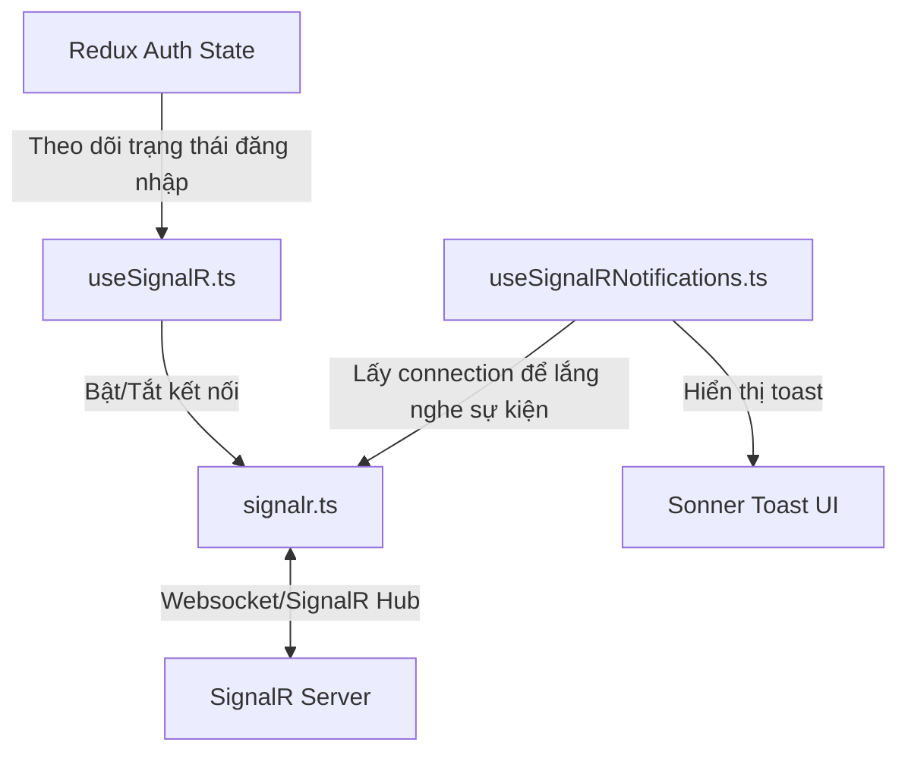
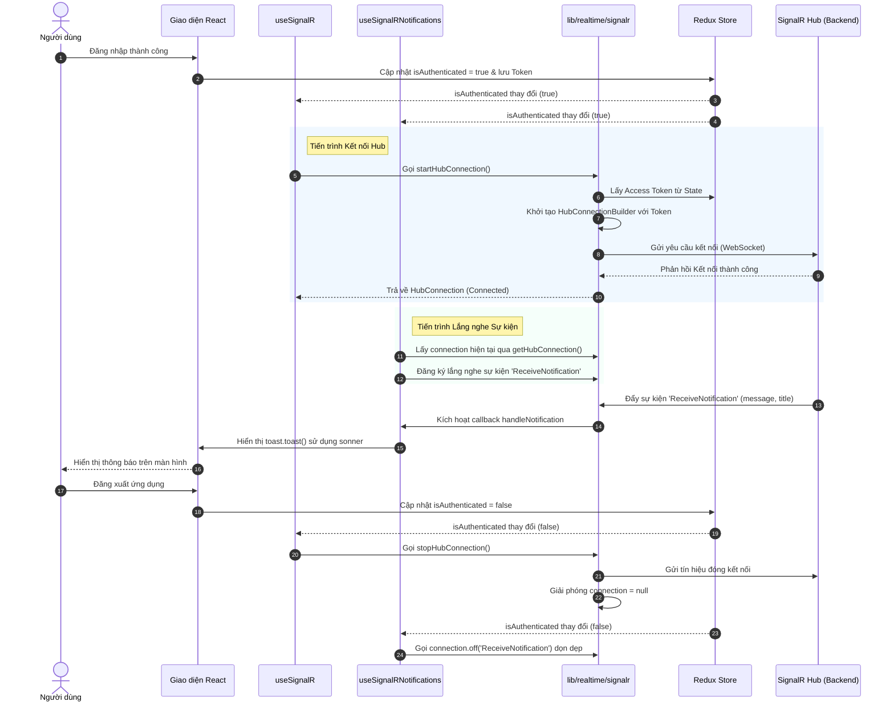

# Hướng dẫn Cơ chế Hoạt động Real-time với SignalR trong Eco Frontend

Tài liệu này giải thích chi tiết về cơ chế thiết lập, quản lý kết nối và lắng nghe các sự kiện thời gian thực (real-time) sử dụng thư viện `@microsoft/signalr` kết hợp với React Hooks và Redux State trong dự án **Eco Frontend**.

---

## 1. Tổng quan Kiến trúc

Cơ chế Real-time được chia làm 3 lớp xử lý rõ ràng tương ứng với 3 file mã nguồn chính:



1. **Lớp Core/Singleton [lib/realtime/signalr.ts](file:///e:/TVu/git-repo/eco-frontend/lib/realtime/signalr.ts)**: Chịu trách nhiệm khởi tạo kết nối dạng Singleton, cấu hình Access Token từ Redux store, tự động kết nối lại (`withAutomaticReconnect`) và cung cấp các hàm khởi chạy/ngắt kết nối một cách an toàn.
2. **Lớp Quản lý Vòng đời [hooks/useSignalR.ts](file:///e:/TVu/git-repo/eco-frontend/hooks/useSignalR.ts)**: React Hook theo dõi trạng thái xác thực (Authentication). Tự động thiết lập kết nối khi người dùng đăng nhập thành công và ngắt kết nối khi họ đăng xuất.
3. **Lớp Lắng nghe và Xử lý Sự kiện [hooks/useSignalRNotifications.ts](file:///e:/TVu/git-repo/eco-frontend/hooks/useSignalRNotifications.ts)**: React Hook đăng ký lắng nghe các sự kiện cụ thể được gửi từ Backend (như `ReceiveNotification`) và hiển thị thông báo giao diện tức thì cho người dùng qua `sonner`.

---

## 2. Chi tiết Lớp Core: [lib/realtime/signalr.ts](file:///e:/TVu/git-repo/eco-frontend/lib/realtime/signalr.ts)

File này đóng vai trò cấu hình và xuất bản các hàm điều khiển cốt lõi cho SignalR Hub.

### Cấu hình Access Token & URL
- **URL của Hub**: Được sinh ra động thông qua hàm `getHubUrl` dựa trên biến môi trường `NEXT_PUBLIC_API_URL` (mặc định là `http://localhost:8080/hubs/app`).
- **Đăng ký Token**: Sử dụng hàm `getAccessToken` để truy xuất trực tiếp Access Token từ Redux store (`store.getState().auth.token`). Hàm này được đưa vào `accessTokenFactory` để đảm bảo mỗi khi kết nối được tạo hoặc kết nối lại, token mới nhất luôn được sử dụng.

### Khởi tạo Kết nối Singleton ([getHubConnection](file:///e:/TVu/git-repo/eco-frontend/lib/realtime/signalr.ts#L30))
Hàm này áp dụng mẫu thiết kế **Singleton** để đảm bảo trong suốt phiên làm việc trên trình duyệt chỉ tồn tại duy nhất một đối tượng `HubConnection`:
- Kiểm tra môi trường Server-Side Rendering (SSR) để đảm bảo không chạy SignalR trên Node.js (`typeof window === "undefined"`).
- Cấu hình tự động kết nối lại với `.withAutomaticReconnect()`.
- Cấu hình mức độ Log dựa trên môi trường phát triển (Development: `LogLevel.Information`, Production: `LogLevel.Warning`).
- Thiết lập các trình theo dõi trạng thái kết nối lại:
  - `onreconnecting`: Gọi khi mất kết nối và đang cố gắng kết nối lại.
  - `onreconnected`: Gọi khi kết nối lại thành công.
  - `onclose`: Gọi khi kết nối bị đóng hoàn toàn.

### Khởi chạy An toàn ([startHubConnection](file:///e:/TVu/git-repo/eco-frontend/lib/realtime/signalr.ts#L49))
Để tránh tình trạng gửi nhiều yêu cầu kết nối song song khi kết nối trước đó đang xử lý (gây ra lỗi SignalR), hàm sử dụng cơ chế khóa Promise (`startPromise`):
- Nếu trạng thái kết nối đã là `Connected`, trả về ngay lập tức.
- Nếu đang trong trạng thái `Connecting`, nó sẽ đợi Promise của yêu cầu trước đó hoàn thành rồi mới tiếp tục.
- Sử dụng biến `startPromise` để lưu lại tiến trình bắt đầu kết nối hiện tại và giải phóng nó (`null`) ngay khi hoàn thành hoặc có lỗi.

### Ngắt kết nối ([stopHubConnection](file:///e:/TVu/git-repo/eco-frontend/lib/realtime/signalr.ts#L72))
- Dừng kết nối hiện tại bằng cách gọi `connection.stop()`.
- Giải phóng bộ nhớ bằng cách gán `connection = null`.

---

## 3. Quản lý Vòng đời Kết nối: [hooks/useSignalR.ts](file:///e:/TVu/git-repo/eco-frontend/hooks/useSignalR.ts)

Hook [useSignalR](file:///e:/TVu/git-repo/eco-frontend/hooks/useSignalR.ts#L12) tự động hóa việc đồng bộ hóa kết nối thời gian thực với trạng thái đăng nhập của người dùng.

```typescript
export function useSignalR() {
  const isAuthenticated = useAppSelector(selectIsAuthenticated);

  useEffect(() => {
    if (!isAuthenticated) return;

    startHubConnection().catch((err) => {
      console.error("[useSignalR] failed to connect", err);
    });

    return () => {
      stopHubConnection();
    };
  }, [isAuthenticated]);
}
```

### Cách thức hoạt động:
1. **Theo dõi trạng thái xác thực**: Hook sử dụng `useAppSelector` để lắng nghe biến trạng thái `isAuthenticated` từ Redux Store.
2. **Khởi chạy kết nối**: Khi `isAuthenticated` chuyển sang `true`, `useEffect` được kích hoạt và thực thi [startHubConnection](file:///e:/TVu/git-repo/eco-frontend/lib/realtime/signalr.ts#L49) để mở kết nối thời gian thực đến Hub.
3. **Ngắt kết nối khi đăng xuất hoặc Unmount**: Hàm dọn dẹp (cleanup function) của `useEffect` sẽ thực thi [stopHubConnection](file:///e:/TVu/git-repo/eco-frontend/lib/realtime/signalr.ts#L72) bất cứ khi nào người dùng đăng xuất (`isAuthenticated` thành `false`) hoặc khi component bọc quanh hook này bị hủy (unmounted).

---

## 4. Đăng ký Sự kiện & Thông báo UI: [hooks/useSignalRNotifications.ts](file:///e:/TVu/git-repo/eco-frontend/hooks/useSignalRNotifications.ts)

Hook [useSignalRNotifications](file:///e:/TVu/git-repo/eco-frontend/hooks/useSignalRNotifications.ts#L13) đảm nhận việc lắng nghe dữ liệu đẩy về từ Server và cập nhật giao diện người dùng.

```typescript
export function useSignalRNotifications() {
  const isAuthenticated = useAppSelector(selectIsAuthenticated);

  useEffect(() => {
    if (!isAuthenticated) return;

    const connection = getHubConnection();

    const handleNotification = (message: string, title?: string) => {
      toast(title || "Thông báo", { description: message });
    };

    connection.on("ReceiveNotification", handleNotification);

    return () => {
      connection.off("ReceiveNotification", handleNotification);
    };
  }, [isAuthenticated]);
}
```

### Cách thức hoạt động:
1. **Xác thực**: Chỉ đăng ký sự kiện khi người dùng đã đăng nhập (`isAuthenticated` là `true`).
2. **Đăng ký Lắng nghe**:
   - Sử dụng [getHubConnection](file:///e:/TVu/git-repo/eco-frontend/lib/realtime/signalr.ts#L30) để lấy thực thể kết nối.
   - Sử dụng phương thức `connection.on("ReceiveNotification", handleNotification)` để đăng ký một callback xử lý khi Server kích hoạt sự kiện `"ReceiveNotification"`.
3. **Giao diện Người dùng**: Nhận `message` và `title` từ Server, sử dụng thư viện `sonner` (`toast`) để hiển thị thông báo dạng pop-up động trên màn hình với hiệu ứng mượt mà.
4. **Hủy đăng ký tránh rò rỉ bộ nhớ (Memory Leak)**: Trong hàm dọn dẹp của `useEffect`, gọi `connection.off("ReceiveNotification", handleNotification)` để gỡ bỏ handler khi người dùng đăng xuất hoặc hook unmount, tránh tình trạng duplicate handler khi re-render.

---

## 5. Luồng hoạt động chi tiết (Flow Sequence)

Dưới đây là sơ đồ luồng tuần tự khi người dùng đăng nhập vào ứng dụng và nhận thông báo thời gian thực:


